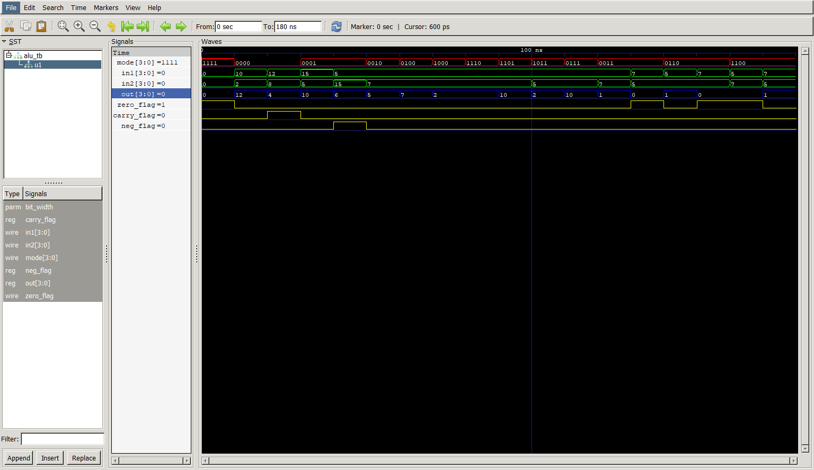

# Parameterized N-Bit ALU using Verilog

A flexible, parameterized $N$-bit Arithmetic Logic Unit (ALU) implemented in Verilog. This design supports arithmetic, logical, comparison, and shifting operations controlled by a 4-bit opcode selector (`mode`).

## Features
- **Parameterized Width:** Easily changes data width (default is 4-bit) via a top-level parameter (`bit_width`).
- **Status Flags:** Computes and outputs standard hardware flags: `zero_flag`, `carry_flag`, and `neg_flag` (2's complement compliant).
- **Pure Combinational Logic:** Designed using default initialization to ensure glitch-free, latch-free synthesis.

## Supported Operations (`mode`)

| Opcode (`mode`) | Operation | Description |

| `4'b0000` | Addition | `out = in1 + in2` (Sets `carry_flag`) |
| `4'b0001` | Subtraction | `out = in1 - in2` (Sets `neg_flag`) |
| `4'b0010` | Bitwise AND | `out = in1 & in2` |
| `4'b0100` | Bitwise OR | `out = in1 \| in2` |
| `4'b1000` | Bitwise XOR | `out = in1 ^ in2` |
| `4'b0011` | Less Than | `out = 1` if `in1 < in2` else `0` |
| `4'b0110` | Equal | `out = 1` if `in1 == in2` else `0` |
| `4'b1100` | Greater Than | `out = 1` if `in1 > in2` else `0` |
| `4'b1110` | Right Shift (`in1`) | Logical right shift of `in1` by 1 bit |
| `4'b1101` | Left Shift (`in1`) | Logical left shift of `in1` (Sets `carry_flag`) |
| `4'b1011` | Right Shift (`in2`) | Logical right shift of `in2` by 1 bit |
| `4'b0111` | Left Shift (`in2`) | Logical left shift of `in2` (Sets `carry_flag`) |

## Simulation Results

Here is the waveform simulation showing the 2's complement signed decimal representation:

Note:
This project uses **Icarus Verilog (iverilog)** for compilation and **GTKWave** for waveform viewing.

